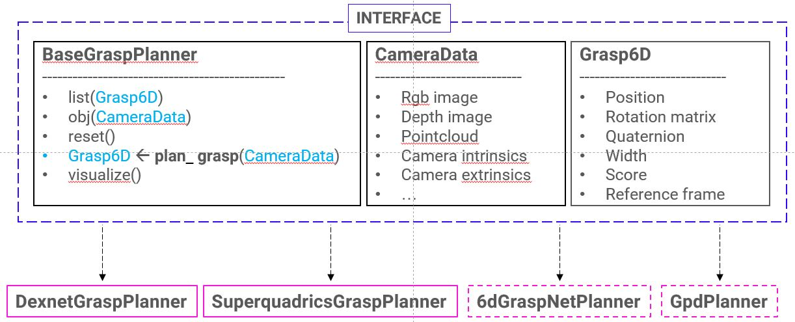
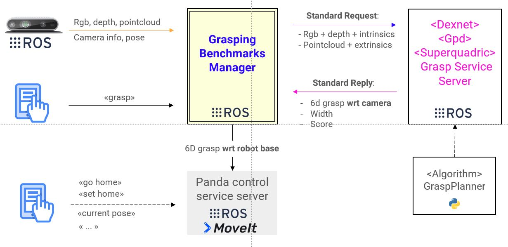

# grasping-benchmarks-panda

## In a nutshell

> _"Jeez, I wish I hadn't chosen to benchmark all these grasping algorithms"_ - probably you, right now

In robotics, it is often useful to try different grasp planners on the same task. At any given time, simply looking at the most promising and cited approaches brings up a good handful of well-performing pieces of work. Users might want to try out a few of these for different purposes, for instance benchmarking or finding the best performing approach for a specific task. Grasping pipelines are, however, usually quite articulated and complex and users will find themselves knee-deep in a puddle of missing dependencies, lack of interface standardization and middleware support.

## Overview
- [In a nutshell](#in-a-nutshell)
- [Contents of this repo](#contents-of-this-repo)
- [Installation](#installation)
    - [grasping benchmarks](#grasping-benchmarks)
    - [grasping benchmarks ros](#grasping-benchmarks-ros)
    - [docker](#docker)
- [Python framework description](#python-framework-description)
- [Grasping Benchmarks Ros Description](#ros-wrapper-description)
     - [How to Run](#how-to-run)
---


## Contents of this repo

This repo simply tries to address the needs of users looking for some help in setting up popular grasp planning approaches. It offers a framework to benchmark different robotic grasp planning algorithms under a common interface. It is designed to work with both a [simulated](https://github.com/hsp-panda/easy_panda_sim) and [real](https://github.com/hsp-panda/panda_moveit_config) [Franka Emika Panda](https://www.franka.de/), because that's what we have currently in our setup (hence the repo and organization name).

It is composed of 3 main modules:
- [grasping_benchmarks](./grasping_benchmarks): a python package that provides the base interface for the grasp planners and a class for each supported algorithm
- [grasping_benchmarks_ros](./grasping_benchmarks_ros): a ROS-based framework that allows to benchmark the grasp planners on the robotic platform. It is supposed to wrap around the previous module
- [docker](./docker): a collection of docker images, one for each supported grasp planner, including
    - the algorithm implementation  within the `grasping_benchmarks` interface, typically in Python
    - the algorithm implementation within the ROS wrapper, typically in Python/C++
    - all the dependencies, compiled and installed
    - the ROS benchmark manager.

So far, this repo includes support for:

| Algorithm | Documentation | Paper |
| --- | --- | --- |
**Dexnet** | [docs](https://berkeleyautomation.github.io/dex-net/)  | [paper](https://arxiv.org/pdf/1703.09312.pdf) |
**GPD** | [docs](https://github.com/atenpas/gpd) | [paper](https://arxiv.org/pdf/1706.09911.pdf) |
**Superquadrics-based grasp planner**  | [docs](https://github.com/robotology/superquadric-lib) | [paper](http://lornat75.github.io/papers/2017/vezzani-icra.pdf) |
(WIP) **6DoF-GraspNet** | [docs](https://github.com/jsll/pytorch_6dof-graspnet) [[original repo]](https://github.com/NVlabs/6dof-graspnet) | [paper](https://arxiv.org/abs/1905.10520) |


## How to install
Python 2.X is dead, long live Python 2.X. We only use **Python3** here.

### grasping_benchmarks
Follow these instructions if you want to install only the python package without the ROS framework.

1. Clone the repository:
    ```bash
    $ https://github.com/hsp-panda/grasping-benchmarks-panda.git

    ```

2. Install the package in editable mode:
    ```bash
    $ cd grasping-benchmarks-panda
    $ pip3 install -e .
    ```

3. Test the installation with:
    ```Python3
    import grasping_benchmarks
    help(grasping_benchmarks)
    ```

### grasping_benchmarks_ros
Follow these instructions if you want to install also the ROS (no ROS2 yet, sorry) framework. In order to install and use this module, you need to include it in a catkin workspace.

1. Install python3 ROS packages:
    ```bashrc
    $ sudo apt update
    $ sudo apt install python3-catkin-pkg-modules python3-rospkg-modules python3-empy
    ```

2. Create a catkin workspace:
    ```bash
    $ mkdir -p ~/catkin_ws/src
    $ cd catkin_ws
    $ wstool init
    ```

3. Add to the catkin workspace some ROS dependencies to be built with python3:
    ```bash
    $ wstool set -y src/geometry2 --git https://github.com/ros/geometry2 -v 0.6.5
    $ wstool set -y src/vision_opencv --git https://github.com/ros-perception/vision_opencv -v 1.13.0
    $ wstool set -y src/ros_numpy https://github.com/eric-wieser/ros_numpy
    $ wstool up
    ```

4. Clone the repository:
    ```bash
    $ wstool set -y src/grasping-benchmarks-panda --git https://github.com/robotology/grasping-benchmarks-panda
    $ wstool up
    ```

5. Install the package in editable mode:
    ```bash
    $ cd src/grasping-benchmarks-panda
    $ pip3 install -e .
    ```

6. Install the dependencies of the algorithm you want to benchmark. You can follow the instructions provided by the authors of each algorithm, or you can take a look at the Docker recipes and see how we did it ourselves. The currently supported algorithms are:
    - **Dexnet**:You need to install [gqcnn](https://berkeleyautomation.github.io/gqcnn/)
    - **GPD**: Follow [gpd](https://github.com/atenpas/gpd)
    - **Superquadrics-based grasp planner**: Follow [superquadric-lib](https://github.com/robotology/superquadric-lib). Note that you need to compile the python bindings.
    - **6DoF-GraspNet**: We used [this PyTorch implementation](https://github.com/jsll/pytorch_6dof-graspnet).

7. You will need a package to move the robot and execute motion primitives such as movement and grasps. We do this with ROS and the MoveIt! stack. If you use ROS, you can borrow our stuff. You will need a Python2 (not quite dead yet, I guess) catkin workspace and a [MoveIt!](http://docs.ros.org/melodic/api/moveit_tutorials/html/index.html) installation where to compile the  [panda_grasp_server](https://github.com/hsp-panda/panda_grasp_server) + [panda_ros_common](https://github.com/hsp-panda/panda_ros_common) packages. If you use different tools and/or middlewares (I am looking at you, [YARP](http://www.yarp.it/git-master/index.html) gremlins) you are going to have to write your own.

8. Build the catkin workspace:
    ```bash
    $ cd ~/catkin_ws
    # Set -DGPD_ROS=ON if you want to benchmark GPD
    $ catkin config --extend /opt/ros/melodic -DPYTHON_EXECUTABLE=/usr/bin/python3 -DCMAKE_BUILD_TYPE=Release -DGPD_ROS=OFF
    $ catkin build
    $ source devel/setup.bash
    $ echo 'source ~/catkin_ws/devel/setup.bash' >> ~/.bashrc
    ```

### docker
If you don't want to bother with manually setting everything up, we advise using our Docker images. We prepared one for each supported algorithm with everything already in place (except the motion planner, for now). You can build the Docker image for the approach of your choosing. If you are not familiar with Docker, take a lookie [here](https://github.com/hsp-panda/dockerfiles-panda). Install it, it's worth it. Afterwards:

1. Clone the repository:
    ```bash
    $ https://github.com/robotology/grasping-benchmarks-panda.git
    $ cd grasping-benchmarks-panda/docker
    ```

2. Use the Makefile to build an image of your choosing:
    ```bash
    $ cd build_images
    $ make USER_NAME=<docker_image_user_name> <target>
    ```
    | targets |
    | ------- |
    | dexnet |
    | gpd |
    | superquadrics |
    | 6dgraspnet |

3. [Optional] There are also two additional docker images that can be built, one with development tools such as qtcreator and atom ([tools/](./docker/tools)) and another one with the Franka Panda libraries such as franka-ros and moveit ([panda_deps/](./docker/panda_deps)).
These images are intended to provide additional features to the images compiled at point 2.

To create the quintessential grasping suite, you can use *docker-compose*. An example script is provided in [/docker/build_images/docker-compose.yaml](./docker/build_images/docker-compose.yaml).

## Python framework description
The `grasping_benchmark` Python package follows the structure shown in the figure below.

<p align="center">
  
</p>

The code of the interface is inside the directory [base/](./base). It provides:
- **BaseGraspPlanner**: the base image that should be inherited by the `<algorithm>GraspPlanner` classes. The principal feature of this class is the `plan_grasp()` method, which takes as input an object of type `CameraData` and returns the grasp pose as an object of type `Grasp6D`.
- **CameraData**: a class that needs to be filled with the camera data necessary to compute a grasp candidate.
- **Grasp6D**: a class that contains the info of the grasp candidate computed by the algorithm.
- **Transformations**: it is provided also a bunch of functions to compute rotation transformations.

Each algorithm that inherits from the *BaseGraspPlanner* interface needs to:
- fill the `plan_grasp()` method with the code to compute the grasp poses
- provide a `create_camera_data()` method that fills the `CameraData` object in the proper format required by the specific algorithm.
- fill the `visualize()` method with the code to visualize the grasp purposes
- eventually extend the `reset()` method.

The python package can be imported in any python code as:
```python
import grasping_benchmarks
```

## ROS Wrapper Description
The grasping benchmark ros framework follows the structure shown in the figure below.

<p align="center">
  
</p>

#### **Grasping Benchmarks Manager**
It is the main actor of the framework, connecting the different modules and sending data to the robot control module.

1. It reads the data sent by a Realsense camera through the ros module [IntelRealSense/realsense-ros](https://github.com/IntelRealSense/realsense-ros.git). The subscribed topics are:
  - `/camera/color/image_raw`: rgb image
  - `/camera/aligned_depth_to_color/image_raw`: aligned depth
  - `/camera/depth_registered/points`: point cloud

  It also reads the camera pose wrt the robot base that should be part of the TF ROS tree. If this is not already taken care in your code, you can simply add it with the `rosrun tf static_transform_publisher` command. For instance, you can add a transform from the `/panda_EE` frame to the `/camera_link` frame:
      ```bash
      $ rosrun tf static_transform_publisher 0.047 -0.03496 -0.08288 0.008 -1.506 3.14 /panda_EE /camera_link 50
      ```
  These values here are strictly relative to our own camera mount, yours will be different and will have to be obtained through a hand-eye calibration.

2. It receives also a few commands from a user through a `user_cmd_service`. Available commands are:
  - `help`: list of available commands
  - `grasp`: computes a new grasp
  - `abort`: abort the grasp computation/execution in case a bad grasp pose is computed

3. It connects with the algorithm service server. It sends the camera data and receives the candidate grasp.

    The service type implemented by the algorithm service server should chosen among the standard services provided, depending on the type of data required by the grasp planning algorithm:
    - [GraspPlanner.srv](./grasping_benchmarks_ros/srv/GraspPlanner.srv)
    - [GraspPlannerCloud.srv](./grasping_benchmarks_ros/srv/GraspPlannerCloud.srv)

    Each service returns a [msg/BenchmarkGrasp.msg](./grasping_benchmarks_ros/msg/BenchmarkGrasp.msg).

4. Finally it connects with the Panda Control service server. It sends the grasp pose as a `geometry_msgs/PoseStamped` message. The Panda Control service server executes the grasp and return the failure/succes of the grasp.

### How to Run

1. Launch your robot control and motion planning stack (or just use [our primitive handling server](https://github.com/hsp-panda/panda_grasp_server), it's free!)

2. Run the benchmarks framework.
    - You may need to set the correct paths to the models/config files in [grasping_benchmarks_ros/launch/grasp_planning_benchmark.launch](./grasping_benchmarks_ros/launch/grasp_planning_benchmark.launch)

    - Specify the name of the algorithm to set up:
      ```bashrc
      $ roslaunch grasping_benchmarks_ros grasp_planning_benchmark.launch realsense:=false <target>:=true
      ```

      | targets |
      | ------- |
      | dexnet |
      | gpd |
      | superquadrics |
      | graspnet |

    - Send grasp commands to the service `/<target>_bench/user_cmd`. For example:
      ```bashrc
      $ rosservice call /dexnet_bench/user_cmd "cmd: {data: 'grasp'}"
      ```

    - Watch it go and/or brace for impact :stuck_out_tongue:

## Maintainers
This repository is maintained by:

| | |
|:---:|:---:|
| [](https://github.com/fbottarel) | [@fbottarel](https://github.com/fbottarel) |
